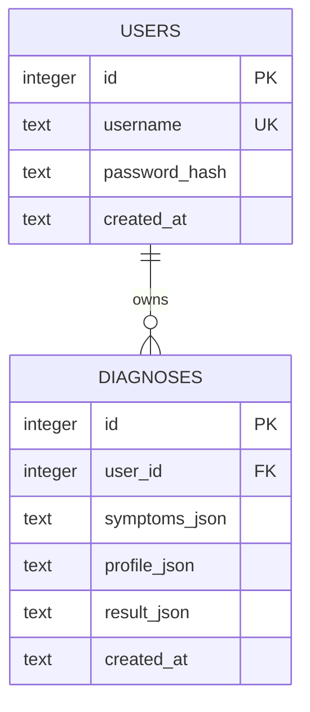

# 数据库设计

## 选型

系统采用 SQLite，理由是部署轻量、无需额外数据库服务，适合毕业设计演示和单机部署。生产环境可平滑迁移到 MySQL/PostgreSQL。

## ER 图

## 表结构

### users

| 字段 | 类型 | 约束 | 说明 |
|---|---|---|---|
| id | INTEGER | PK AUTOINCREMENT | 用户 ID |
| username | TEXT | NOT NULL UNIQUE | 用户名 |
| password_hash | TEXT | NOT NULL | bcrypt 哈希 |
| created_at | TEXT | NOT NULL | 创建时间 |

### diagnoses

| 字段 | 类型 | 约束 | 说明 |
|---|---|---|---|
| id | INTEGER | PK AUTOINCREMENT | 记录 ID |
| user_id | INTEGER | FK | 所属用户 |
| symptoms_json | TEXT | NOT NULL | 症状 ID 数组 |
| profile_json | TEXT | NOT NULL | 年龄、性别、作息等信息 |
| result_json | TEXT | NOT NULL | 完整分析结果 |
| created_at | TEXT | NOT NULL | 创建时间 |

## 数据字典

| 数据项 | 说明 | 示例 |
|---|---|---|
| symptoms_json | 用户选择的症状 ID | `["dry_mouth","insomnia"]` |
| profile_json | 用户基础信息 | `{"age":"22","gender":"女"}` |
| result_json | 体质、七日计划、子午流注等分析结果 | `{ "constitution": { ... } }` |

## 数据安全

- 密码只保存哈希，不保存明文。
- 登录凭证通过 JWT 传递。
- 诊断图片默认仅用于本次请求，结束后清理，不进入数据库。
