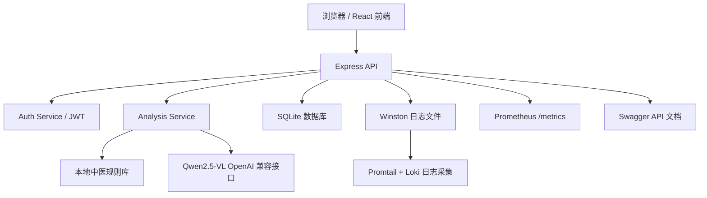
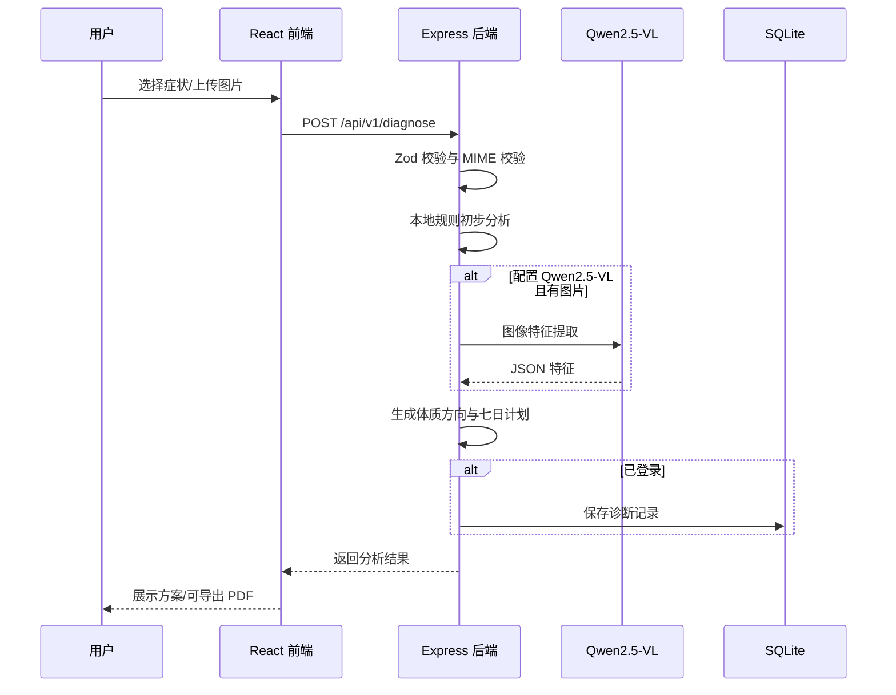

# 系统设计

## 总体架构

## 前端模块

| 模块 | 路径 | 职责 |
|---|---|---|
| 组件 | `src/components/` | 文件上传、结果卡片、计划表、导航、登录面板 |
| 页面 | `src/pages/` | 采集页、历史页、帮助页、关于页 |
| Hooks | `src/hooks/` | 用户状态、运行时配置、滚动区块高亮 |
| API 服务 | `src/services/api.js` | 后端请求、超时取消、JWT 传递 |

## 后端模块

| 模块 | 路径 | 职责 |
|---|---|---|
| Controller | `src/controllers/` | 接收请求并返回响应 |
| Service | `src/services/` | 认证、诊断、历史记录、定时任务 |
| Model | `src/models/` | SQLite 初始化与数据访问 |
| Middleware | `src/middleware/` | 鉴权、上传、错误处理 |
| Routes | `src/routes/` | API 路由与 Swagger 注释 |

## 诊断流程

## 接口设计

| 方法 | 路径 | 说明 | 鉴权 |
|---|---|---|---|
| GET | `/health` | 健康检查与模型上游探测 | 否 |
| GET | `/metrics` | Prometheus 兼容运行指标 | 否 |
| GET | `/api/v1/symptoms` | 获取症状列表 | 否 |
| POST | `/api/v1/auth/register` | 注册 | 否 |
| POST | `/api/v1/auth/login` | 登录 | 否 |
| GET | `/api/v1/auth/me` | 当前用户 | 是 |
| POST | `/api/v1/diagnose` | 生成方案 | 可选 |
| GET | `/api/v1/history` | 历史记录 | 是 |
| GET | `/api/v1/history/:id` | 历史详情 | 是 |

## 安全设计

- Helmet 设置安全响应头。
- CORS 默认拒绝非同源未知来源。
- `express-rate-limit` 限制诊断接口频率。
- Multer 限制单张图片 8MB，并校验 MIME。
- 错误响应脱敏，详细日志写入 Winston。
- JWT 用于用户鉴权，密码使用 bcryptjs 哈希。

## 运维监控

- `/metrics` 输出 Prometheus 兼容指标，包括请求次数、请求耗时、进程运行时长和模型配置状态。
- `docker-compose.cloud.yml` 提供 `observability` profile，可按需启动 Prometheus、Grafana、Loki 与 Promtail。
- 后端日志按天轮转落盘，Promtail 可读取 `backend-logs` 卷并推送到 Loki。

