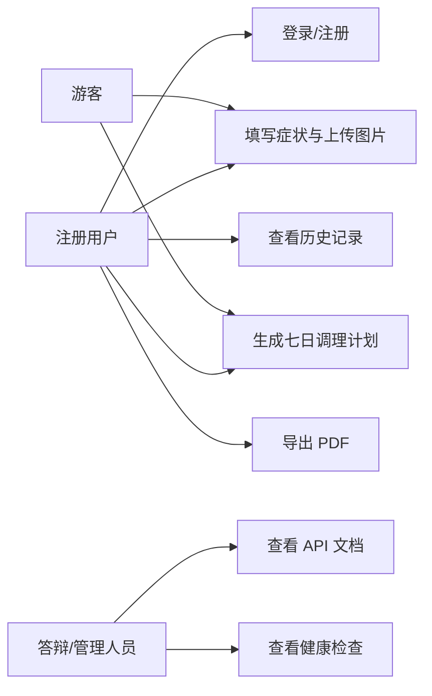

# 需求分析

## 项目背景

中医养生类应用常见问题是用户输入分散、结果不可追溯、缺少可解释的调理路径。本系统面向毕业设计场景，构建一个具备图像采集、症状归类、七日计划、用户历史和工程化部署能力的中医养生辅助系统。

## 用户角色

| 角色 | 说明 |
|---|---|
| 游客 | 可选择症状、上传图片、生成一次性方案 |
| 注册用户 | 可登录、生成方案、查看历史记录、导出报告 |
| 管理/答辩人员 | 可查看 API 文档、部署状态和测试结果 |

## 功能需求

| 编号 | 需求 | 优先级 | 验收标准 |
|---|---|---|---|
| FR-01 | 用户注册与登录 | P0 | 用户可注册、登录并获取 JWT |
| FR-02 | 症状选择 | P0 | 前端从后端接口获取症状列表 |
| FR-03 | 图像采集 | P0 | 支持舌像、面相、手相上传、预览和删除 |
| FR-04 | 养生方案生成 | P0 | 至少选择一个症状或图片后可生成方案 |
| FR-05 | 子午流注展示 | P0 | 展示时辰、经脉、时间范围和建议 |
| FR-06 | 历史记录 | P0 | 登录用户生成方案后可在历史页查看 |
| FR-07 | PDF 导出 | P1 | 生成方案后可导出报告 PDF |
| FR-08 | API 文档 | P1 | `/api-docs` 可查看接口文档 |
| FR-09 | 明暗主题 | P2 | 用户可切换主题并保留偏好 |
| FR-10 | 帮助与关于页面 | P2 | 提供操作说明和系统说明 |

## 非功能需求

| 编号 | 需求 | 说明 |
|---|---|---|
| NFR-01 | 安全性 | CORS 白名单、Helmet 安全头、限流、错误脱敏 |
| NFR-02 | 可维护性 | controller/service/model 分层，前端组件拆分 |
| NFR-03 | 可测试性 | 后端接口测试、前端组件测试 |
| NFR-04 | 可部署性 | Docker、HEALTHCHECK、CI/CD |
| NFR-05 | 可追溯性 | SQLite 持久化用户与诊断记录 |

## 用例图

