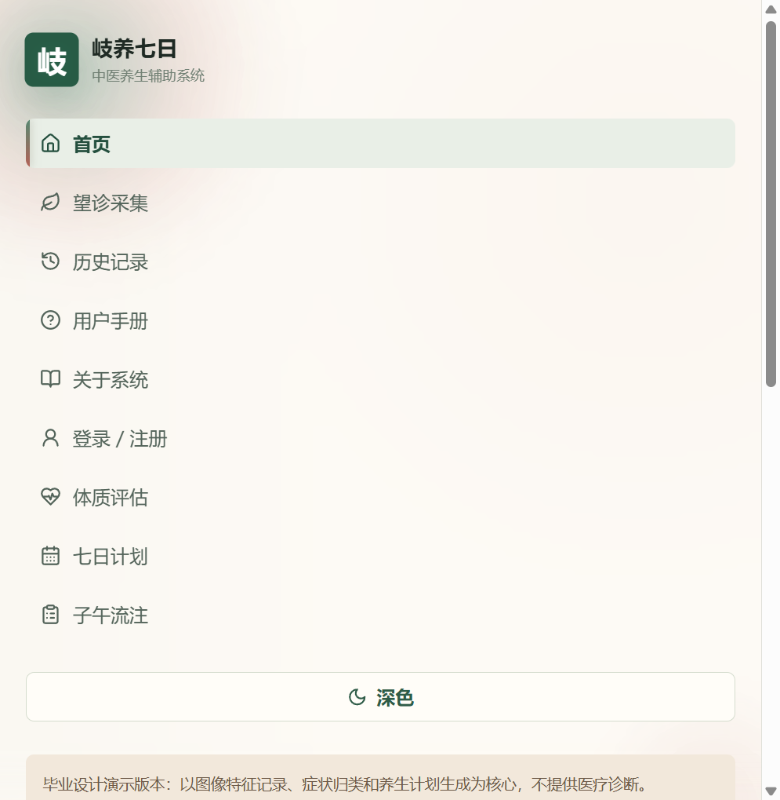
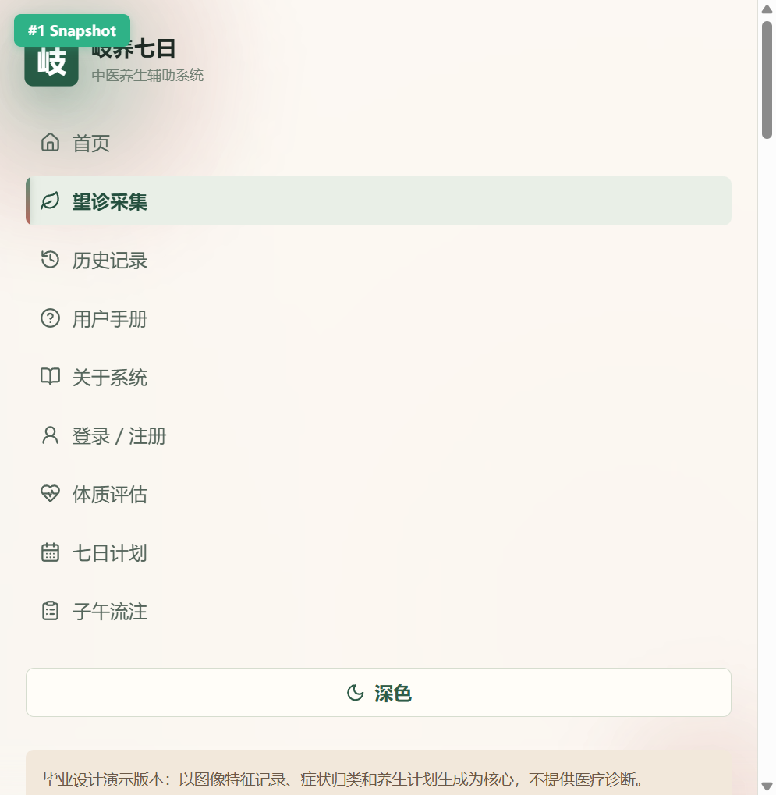
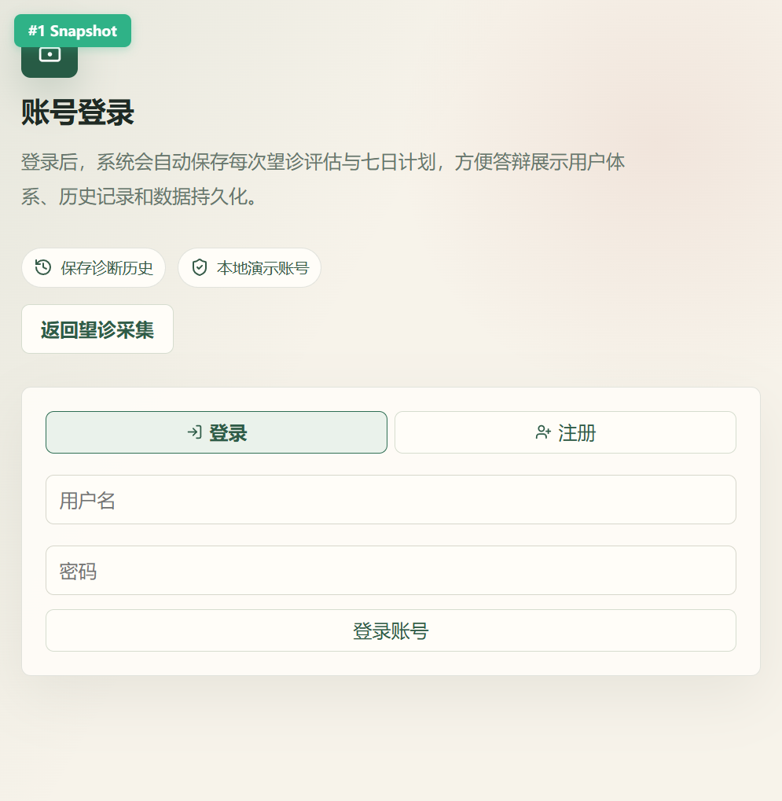
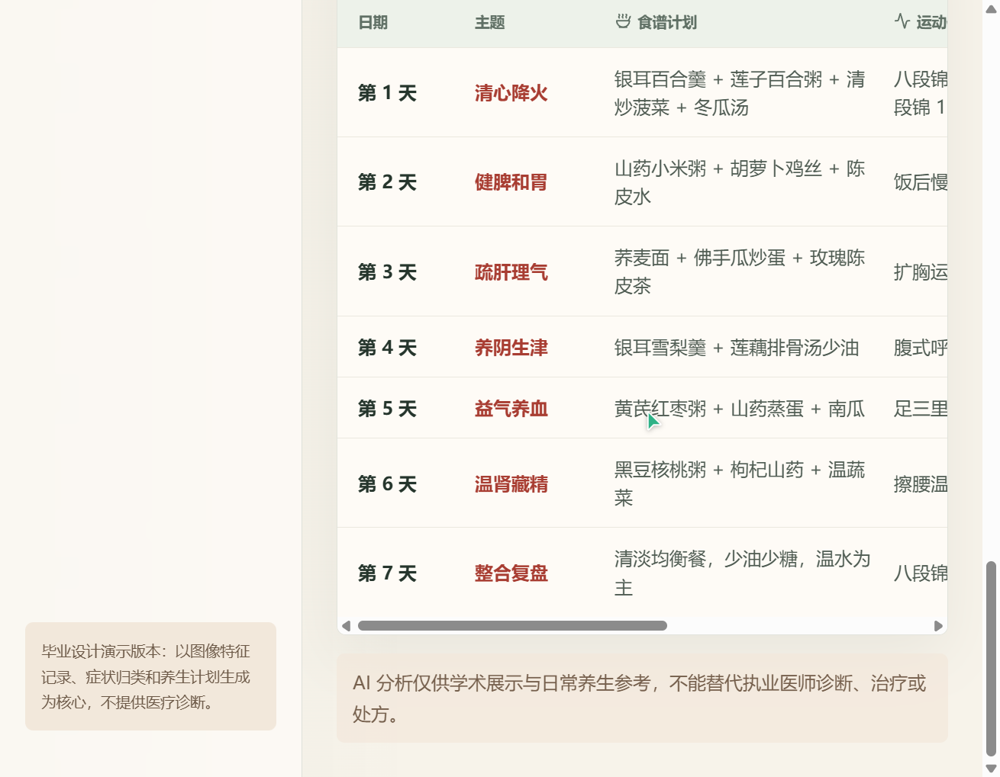

【社会服务赛道】岐养七日 · AI中医望诊与七日养生辅助系统

#社会服务

---

## 0. 先和大家打个招呼吧 👋

你是谁：一名在校大学生，毕业设计选了中医养生方向。

你是怎么用 TRAE 把 Demo 做出来的：

在做这个项目之前，我的开发经验主要停留在课程作业级别，没做过前后端分离的完整项目。用 TRAE 最大的感受是：它让我能专注于"我想做什么"，而不是被困在"这个语法怎么写""这个报错怎么解决"里。

我是怎么跟 TRAE 配合的呢？说白了就是聊天。我把脑子里的想法一句句讲给它听——"我要一个中医养生系统，用户上传舌像选症状，然后生成七天计划"。它会帮我拆成具体的模块：前端几个页面、后端几层架构、数据库建几张表。我说"这一步我要体质辨识的规则"，它就帮我把九大体质的症状映射写成代码。

最让我觉得"原来这么简单"的一步是 Docker 部署。以前觉得容器化是高级运维的事，结果跟 TRAE 说清楚需求后，它帮我把 Dockerfile、GitHub Actions、Hugging Face Space 部署全配好了。我的角色更像产品经理，告诉它中医规则引擎的逻辑，它负责把代码写出来。

---

## 1. Demo 简介

是什么：一个中医养生辅助网站。用户上传舌像/面相/手相图片并选择症状，系统生成体质方向、子午流注建议和七日调理计划。

面向谁：25-45 岁关注健康的成年人，对中医养生有兴趣但缺乏系统知识，希望通过日常调理改善亚健康状态。

主要功能：

**功能一：望诊采集 + 智能分析**
支持舌像、面相、手相图片上传与拖拽，本地规则引擎根据症状计算体质方向（九大体质分类）。接入 Qwen3-VL 图像理解，提取望诊图片特征后会反向影响体质评分（如识别到"舌红少苔"会加权重阴虚方向），实现 AI 视觉与规则引擎的双向融合。

**功能二：子午流注 + 七日计划**
结合当前时辰推荐对应经脉的养生建议（如子时养胆经、卯时大肠经当令），生成覆盖饮食、运动、作息的七天调理方案，每天含早中晚三个时段建议。封面页会根据访问时间实时显示当前时辰的养生提示。

**功能三：用户体系 + 历史记录**
JWT 注册登录，SQLite 持久化诊断记录，支持查看历史体质变化和 PDF 报告导出。独立的登录页面展示用户体系的价值。

**功能四：沉浸式封面页**
粒子动画模拟经络流动，太极元素装饰，根据访问时间实时显示子午流注提示，支持明暗主题切换。

产品截图：

截图1：封面页 — 粒子动画 + 子午流注实时提示 + 太极元素

截图2：望诊采集界面 — 舌像/面相/手像上传区 + 症状选择区

截图3：登录页 — 用户体系入口 + 历史记录说明

截图4：七日计划结果 — 体质评估 + 子午流注建议 + 七天饮食运动作息计划表

---

## 2. Demo 创作思路

灵感来源：做毕业设计时选了中医方向，查阅资料发现中医的体质辨识和子午流注理论非常成体系，但这些知识停留在古籍和专家头脑里，普通人很难直接拿来用。

想解决的问题：市面上养生应用要么只推送泛泛的科普文章，要么把体质测试做成娱乐问答，测完之后没有可落地的行动方案。用户真正需要的是：告诉我现在是什么体质方向，然后给我接下来七天每天吃什么、做什么运动、几点睡觉。

为什么做这个方向：中医养生的知识门槛高，线下咨询又贵又难持续。把规则引擎和 AI 图像理解结合，做成一个普通人能用的 Web 应用，既有社会价值，又有技术挑战——如何把中医知识编码成可解释、可追溯的规则，同时用大模型弥补图像分析的短板，这个"人机协作"的架构设计让我觉得值得做。

---

## 3. Demo 体验地址

**在线体验链接**：https://xyzzyx2026-bysj-zyysfzxt.hf.space

**HTML创意产物**：已上传自包含 HTML 文件（project-showcase-standalone.html），可直接在浏览器打开查看完整项目介绍。

补充链接：
- GitHub 仓库：https://github.com/yz314-yz/xyzbysj
- API 文档：https://xyzzyx2026-bysj-zyysfzxt.hf.space/api-docs
- 健康检查：https://xyzzyx2026-bysj-zyysfzxt.hf.space/health

> 首页打开后，选择症状或上传图片，点击"生成七日调理计划"即可体验完整流程。未配置 Qwen3-VL 时系统使用本地规则引擎，功能不受影响。

---

## 4. TRAE 实践过程

整个项目从需求到部署，全程使用 TRAE IDE 的 AI 辅助完成，以下是完整开发流程：

### 第一步：需求梳理与架构设计

与 TRAE 对话，扫描项目与完整毕业设计的差距，识别出"四无"短板（无数据库、无用户体系、无测试、无学术文档），并提供了分优先级的补救建议。随后梳理用户角色（游客、注册用户、管理人员）和功能需求优先级，拆分出前端组件、后端 controller/service/model 三层架构。

> Session ID：6a37c9e4799e77f9b958a26c

### 第二步：后端开发与部署启动

通过对话式编程完成后端核心：Express API 搭建、JWT 认证、SQLite 数据模型、Zod 校验、Multer 文件上传、中医规则引擎（九大体质 + 子午流注 + 七日计划）、Qwen3-VL 接入、Swagger 文档、Winston 日志、Prometheus 指标、Helmet 安全头、express-rate-limit 限流。同时创建 .env.cloud 配置并启动公网部署。

> Session ID：6a3d039644c80707aed39755

### 第三步：测试与文档

TRAE 生成 Jest + Supertest 后端接口测试、Vitest 前端组件测试，以及需求分析、系统设计、数据库设计、测试报告、用户手册五份文档。后续完成了参赛材料整理、产品截图采集和 Demo 在线验证。

> Session ID：6a411d54589da9b86f9a70b5

---

## 5. 对应的报名审核通过的帖子链接

https://forum.trae.cn/t/topic/49901

---

> 免责声明：系统输出仅供日常养生参考，不能替代执业医师诊断、治疗或处方。

